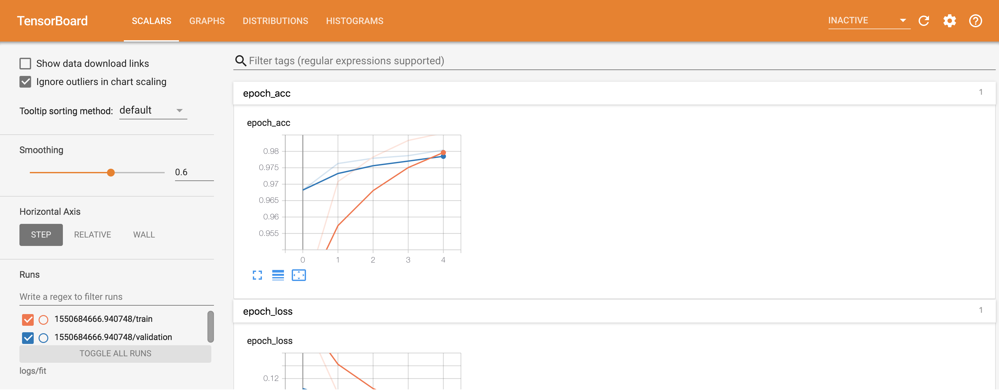

# Tensorflow Facial Recognition

A facial recognition software created using Tensorflow 2.6

## Table of Contents <a name="toc"></a>

1. [Introduction](#intro)
2. [Setup](#setup)
    - [2.1. Python Environment](#pyenv)
        - [2.1.1. Install virtualenv](#insvenv)
        - [2.1.2. Create environment](#crenvpy)
        - [2.1.3. Activate environment](#actenvpy)
        - [2.1.4. Installing dependencies](#insdeps)
        - [2.1.5. Deactivate environment](#deactenvpy)
    - [2.2. Conda Envrionment](#conenv)
        - [2.2.1. Create environment](#crenvcon)
        - [2.2.2. Activate environment](#actenvcon)
        - [2.2.3. Deactivate environment](#deactenvcon)
3. [Configurations](#configs)
    - [3.1. Architecture](#configarch)
    - [3.2. Train](#configtrain)
    - [3.3. Test](#configtest)
4. [Model Architecture](#modelarch)
5. [Train Model](#train)
    - [5.1. Dataset Preparation](#dataprep)
    - [5.2. Syntax](#trainsyn)
    - [5.3. Arguments](#trainargs)
    - [5.4. Classes](#traincls)
    - [5.5. Checkpoints](#trainckpts)
    - [5.6. Models](#trainmodels)
    - [5.7. Tensorboard](#tboard)
6. [Evaluate Model](#eval)
    - [6.1. Dataset Preparation](#evaldataprep)
    - [6.2. Syntax](#evalsyn)
    - [6.3. Arguments](#evalargs)
7. [Predictions{WIP}](#preds)
8. [TFRecords{WIP}](#tfrecs)
    - [8.1. Create TFRecords](#createtfrecs)
        - [8.1.1. Syntax](#syntfrecs)
        - [8.1.2. Arguments](#argstfrecs)
    - [8.2. Train](#traintfrecs)
    - [8.3. Evaluate](#evaltfrecs)
9. [Training Attempts](#trains)
10. [Dependencies](#deps)

## 1. Introduction <a name="intro"></a>

<p align="right"><a href="#toc">Table of contents ↑</a></p>

- This is a project created for facial recognition. 

- This project contains of a [Convolutional Neural Network(CNN)](https://en.wikipedia.org/wiki/Convolutional_neural_network) model and it can be  trained for a dataset containing faces of the people that need to be detected/recognized by the model.

- After a model is trained for a dataset, it can be used to recognize faces that were part of the training dataset. 

- **The model can be trained or evaluated using image datasets as they are or tfrecord datasets can be created using them. If the datasets are larger, the latter is recommended.**

## 2. Setup <a name="setup"></a>

<p align="right"><a href="#toc">Table of contents ↑</a></p>

- In order to run this script, an environment needs to be created and all the dependencies of this code should be installed to the created environment.

- The script was developed using **Python 3.8.8** and thus the recommended version for running scripts in this repository.

- There are two options for this to be done. You can either use the Python Environment option or the Conda Environment option.

- **Setting up a Python environment is much easier than setting up a Conda environment**. If you've never worked with either of them, I suggest the first option. If you are familiar with Conda and have Conda installed on your computer, the Conda environment option is for you.

### 2.1. Python Environment <a name="pyenv"></a>

#### 2.1.1. Install virtualenv <a name="insvenv"></a>

- A Python virtual environment is created using the Python package, `virtualenv`.

- `virtualenv` can be installed using the follwing command.

    ```
    pip install virtualenv
    ```
#### 2.1.2. Create environment <a name="crenvpy"></a>

- After installing `virtualenv`, it can be used to create a python virtual environment.

- Use the following script to create a virtual enviornment named *facial_recog* in the current directory you're on.

    ```
    virtualenv facial_recog
    ```

#### 2.1.3. Activate environment <a name="actenvpy"></a>

- The process of activating a virtual environment varies with the Operating System and below are separate guides to activate a virtual environment on Linux and Windows.

    ##### Linux

- Use the following command to activate the created virtual environment on Linux.

    ```
    source facial_recog/bin/activate
    ```

    ##### Windows

- Use the following command to activate the created virtual environment on Windows.

    ```
    facial_recog/Scripts/activate
    ```

#### 2.1.4. Installing dependencies <a name="insdeps"></a>

- Install required dependencies to the activated virtual environment using the following command. **Make sure you are executing the command in the main directory of the repository, where `requirements.txt` is located**.

    ```
    pip install -r requirements.txt
    ```
**After installing dependencies, you can run the scripts on the virtual environment created.**

#### 2.1.5. Deactivate environment <a name="deactenvpy"></a>

- The following command will deactivate the virtual environment.

    ```
    deactivate
    ```

### 2.2. Conda Environment <a name="conenv"></a>

Make sure you have successfully installed [Conda](https://docs.conda.io/en/latest/) on your computer.

#### 2.2.1. Create environment <a name="crenvcon"></a>

- Use the following command to create the conda environment with requirements already installed. **Make sure you are executing the command in the main directory of the repository, where `env.yml` is located**

    ```
    conda env create -f env.yml
    ```

#### 2.2.2. Activate environment <a name="actenvcon"></a>

- Use the following command to activate the created environment.

    ```
    conda activate facial_recog
    ```

#### 2.2.3. Deactivate environment <a name="deactenvcon"></a>

- Use the following command to deactivate the Conda environment.

    ```
    conda deactivate
    ```

If you followed the above steps properly, now you're ready to run scripts.

## 3. Configurations <a name="configs"></a>

<p align="right"><a href="#toc">Table of contents ↑</a></p>

- All configurations can be found at `config.py`. 

- Configurations are divided into *Architecture*, *Train* and *Test* for ease of use.

### 3.1. Architecture <a name="configarch"></a>

| Config | Description | Notes |
|--------|-------------|-------|
| `image_height` | Height of an image processed by scripts | Will be used in reading images and setting model input shape |
| `image_width` | Width of an image processed by scripts | Will be used in reading images and setting model input shape |
| `input_channels` | Number of channels in input images | Use default **3** for RGB images. |
| `hidden_layers` | Number of hidden layers(Dense layers) in the model | Use less layers for simple models and more layers for more complicated models |
| `dropout_rate` | Dropuot rate to be used in Dropout layers in the model | Use a value between 0 and 1 |

### 3.2. Train <a name="configtrain"></a>

| Config | Description | Notes |
|--------|-------------|-------|
| `batch_size` | Size of image batches used in loading images, training  | Suggested values: 8, 16, 32, 64, 128 |
| `epochs` | Number of epochs the model should trin for | An integer value must be used. This can be overridden using the `--epochs` argument in training script. For more details, see [Train Model](#train) section |
| `learning_rate` | Learning rate of the optimixer algorithm | Can be changed to prevent overfitting/underfitting |
| `patience_epochs` | Number of epochs with no improvement after which training will be stopped | If the validation accuracy does not improve for this many epochs, training process will stoped |
| `validation_split` | Portion of the training dataset that is plit for validation | Use a value between 0 and 1 |

### 3.3. Test <a name="configtest"></a>

| Config | Description | Notes |
|--------|-------------|-------|
| `batch_size` | Size of image batches used in evaluating models | Suggested values: 8, 16, 32, 64, 128 | 

## 4. Model Architecture <a name="modelarch"></a>

<p align="right"><a href="#toc">Table of contents ↑</a></p>

Current architecture of the facial recognition model:

    ```
    _________________________________________________________________
    Layer (type)                 Output Shape              Param #
    =================================================================
    mobilenetv2_1.00_224 (Functi (None, 6, 6, 1280)        2257984
    conv2d (Conv2D)              (None, 4, 4, 32)          368672
    _________________________________________________________________
    dropout (Dropout)            (None, 4, 4, 32)          0
    _________________________________________________________________
    global_average_pooling2d (Gl (None, 32)                0
    _________________________________________________________________
    dense (Dense)                (None, 3)                 99
    =================================================================
    Total params: 2,626,755
    Trainable params: 368,771
    Non-trainable params: 2,257,984
    _________________________________________________________________
    ```

- A pre-trained [MobileNetV2](https://www.tensorflow.org/api_docs/python/tf/keras/applications/mobilenet_v2/MobileNetV2) model is used for image feature extraction.

## 5. Train Model <a name="train"></a>

<p align="right"><a href="#toc">Table of contents ↑</a></p>

Below is a guide to train the model from scratch using image datasets(without converting them to tfrecords. For tfrecords option, see [TFRecords] below)

### 5.1. Dataset Preparation <a name="dataprep"></a>

**To work with the scripts, train and test datasets should be created as follows**.

- Whole dataset should be inside a single folder.

- Inside that folder, there should be separate folders for each class. In this case, a folder for each person that is in the dataset. Each folder needs to be renamed after the person's name.

- Images that contain the face of relevant employee should be inside each folder.

For an example, Let's assume that there are 5 employees in a company. They are named `Amal`, `Max`, `Sebastian`, `Lihini` and `Christina`. If the company wants to train a model to enable facial recognition for them, their train and test datasets should have a structure as follows:

```
dataset
|-Amal
|   |-amal1.jpg
|   |-amal2.jpg
|-Max
|   |-max1.jpg
|   |-max2.jpg
|-Sebastian
|   |-sebastian1.jpg
|   |-sebastian2.jpg
|-Lihini
|   |-lihini1.jpg
|   |-lihini2.jpg
|-Christina
|   |-chris1.jpg
|   |-chris2.jpg
```

**NOTE: Image files are not required to conform to any naming conventions**.

### 5.2. Syntax <a name="trainsyn"></a>

- `train_from_images.py` is used to train facial recognition model. The syntax is as follows.

```
python train_from_images.py
    --dataset_path PATH/TO/THE/FOLDER/CONTAINING/TRAINING/DATASET
    --model_save_path PATH/TO/THE/FOLDER/MODEL/SHOULD/BE/SAVED/TO
    --epochs NUMBER/OF/EPOCHS/TO/TRAIN
```

### 5.3. Arguments <a name="trainargs"></a>

| Argument | Description | Notes |
|----------|-------------|-------|
| `-p` / `--dataset_path` | Path to the dataset containing the train data | This data must conform to data discussed in [Dataset Preparation](#dataprep) section |
| `-m` / `--model_save_path` | Path of the folder to save the trained model | A model named with proper naming conventions (discussed in [Models] section) will be saved tho this location |
| `-e` / `--epochs` | Number of epochs to train | **Not Mandatory**. If a value is passed, it will override the value in `epochs` configuration. |

### 5.4. Classes <a name="traincls"></a>

- Classes in the dataset will be saved into a pickle file named `classes.pkl` after loading the images from the dataset folder.

- Class names will be derived from the folder names in the dataset folder. Make sure there aren't any unwanted folders inside the dataset folder.

- For the file structure mentioned in the [Dataset Peparation](#dataprep), the pickle file will save class names as a list like [`Amal`, `Max`, `Sebastian`, `Lihini`, `Christina`]

### 5.5. Checkpoints <a name="trainckpts"></a>

- A checkpoint will be saved which will contain **ONLY** the weights of the epoch with the maximum validation accuracy to the `checkpoints` folder. 

- The checkpoint file will be named as `facial_recog_{date}_{time}.ckpt`.

### 5.6. Models <a name="trainmodels"></a>

- After training finishes, the complete trained model will be saved to the path specified by the `--model_save_path` argument.

- The model will be saved in a folder named as `facial_recog_model_{date}_{time}`.

### 5.7. Tensorboard <a name="tboard"></a>

- Training and validation metrics(loss and accuracy) for all trained epochs will be saved so that they can be used to visualizations using [Tensorboard](https://www.tensorflow.org/tensorboard).

- These data will be saved to `tensorboard` folder.

- Each time a model is trained, a separate folder will be created inside the `tensorboard` folder named `tensorboard_{date}_{time}`.

- Simply run the following command to start the Tensorboard server to visualize training metrics.

    ```
    tensorboard --logdir tensorboard/tensorboard_{date}_{time}
    ```

- For an example, if the model was trained on 20/02/2021 at 12:56:09, it will create a tensorboard data folder named `tensorboard_20210220_125609` and the follwing command will start the Tensorboard server.

    ```
    tensorboard --logdir tensorboard/tensorboard_20210220_125609
    ```

- After the server is started, navigate to the link displayed on the terminal and a dashboard similar to the one in image below will be rendered on your web browser.


<p align="center">Image courtesy: <a href="https://www.tensorflow.org/tensorboard/get_started">Get started with TensorBoard</a</p>

## 6. Evaluate Model <a name="eval"></a>

<p align="right"><a href="#toc">Table of contents ↑</a></p>

Following is a guide to evaluate trained models.

- Currently the script is enabled to evaluate **fully saved models only**. Functionality to evaluate saved weights on checkpoint files has not been implemented yet.

### 6.1. Dataset Preparation <a name="evaldataprep"></a>

- The evaluation dataset should conform to the dataset structure described in [Dataset Preparation](#dataprep) in the [Train Model](#train) section.

### 6.2. Syntax <a name="evalsyn"></a>

- `evaluate_from_images.py` is used to train facial recognition model. The syntax is as follows.

```
python evaluate_from_images.py
    --dataset_path PATH/TO/THE/FOLDER/CONTAINING/EVALUATION/DATASET
    --model_path PATH/TO/THE/TRAINED/MODEL/THAT/NEEDS/TO/BE/EVALUATED
```

- After the completion of evaluation, loss and accuracy will be displayed.

### 6.3. Arguments <a name="evalargs"></a>

| Argument | Description | Notes |
|----------|-------------|-------|
| `-p` / `--dataset_path` | Path to the folder containing evaluation data | This data must conform to data discussed in [Dataset Preparation](#dataprep) section |
| `-mp` / `--model_path` | Path to the saved model that needs to be evaluated | Should be a valid path to a Tensorflow SavedModel |

## 7. Predictions - [Work In Progress] <a name="preds"></a>

<p align="right"><a href="#toc">Table of contents ↑</a></p>

- Taking predictions for a single image using a trained model.

- Still work in progress.

## 8. TFRecords - [Work In Progress] <a name="tfrecs"></a>

<p align="right"><a href="#toc">Table of contents ↑</a></p>

- The option to train and evaluate models using TFRecords.

- Refer [this link](https://www.tensorflow.org/tutorials/load_data/tfrecord) For further details about TFRecords.

- This method is recommended if the size of the train and evaluation datasets are bigger.

- TFRecords files for train and evaluation sets should be created prior to train and evaluation processes.

### 8.1. Create TFRecords <a name="createtfrecs"></a>

- `create_tfrecords.py` is used to create TFRecords.

#### 8.1.1. Syntax <a name="syntfrecs"></a>

```
python create_tfrecords.py
    --dataset_path PATH/TO/THE/DATASET
    --mode DATASET/TYPE
    --output_path PATH/TO/THE/FOLDER/TO/SAVE/TFRECORDS
```

- After execution, a TFRecords file named `{mode}.tfrecords` will be saved in the folder specified by *output_path*.

#### 8.1.2. Arguments <a name="argstfrecs"></a>

| Argument | Description | Notes |
|----------|-------------|-------|
| `-p` / `--dataset_path` | Path to the folder containing train/test dataset |  This data must conform to data discussed in [Dataset Preparation](#dataprep) section |
| `-m` / `--mode` | Type of the dataset | Enter `Train` to create train set, `Test` to create test set. Not case sensitive. Defaulted to `Train` |
| `-o` / `--output_path` | Path to the folder where TFRecords file/s should be written into | Make sure to enter a path to a valid folder |

### 8.2. Train <a name="trainfrecs"></a>

- Scripts to train a model using TFRecords has not been implemented yet.

### 8.3. Evaluate <a name="evaltfrecs"></a>

- Scripts to evaluate a model using TFRecords has not been implemented yet.

## 9. Training Attempts <a name="trains"></a>

<p align="right"><a href="#toc">Table of contents ↑</a></p>


## 10. Dependencies <a name="deps"></a>

<p align="right"><a href="#toc">Table of contents ↑</a></p>

Below are the main dependencies of the repository:

```
tensorflow-gpu==2.6.0
scikit-learn==0.24.1
matplotlib==3.3.4
pandas==1.2.4
ipython==7.22.0
numpy==1.19.5
seaborn==0.11.1
joblib==1.0.1
glog==0.3.1
```
